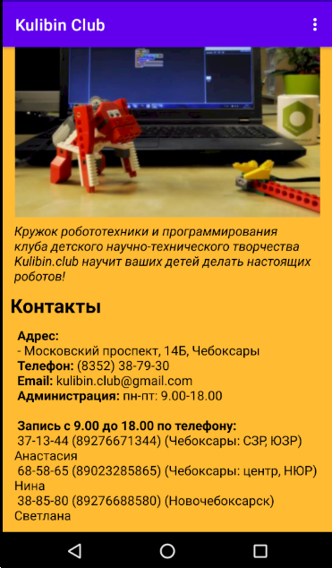
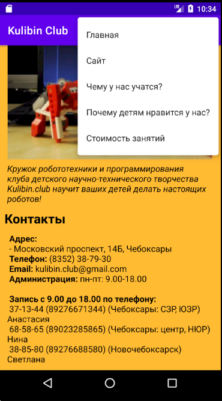
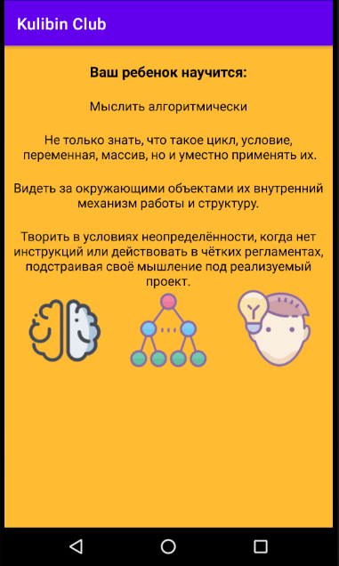
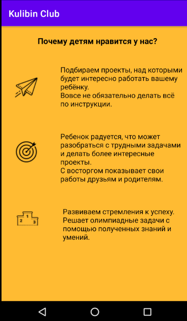
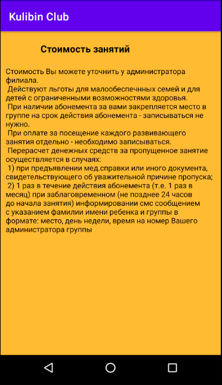

# ProjectKulibin
Этот проект был создан для знакомства с AndroidStudio и языками программирования Java/Kotlin.

Данные приложение содержит информацию о кружке программирования и робототехники.

